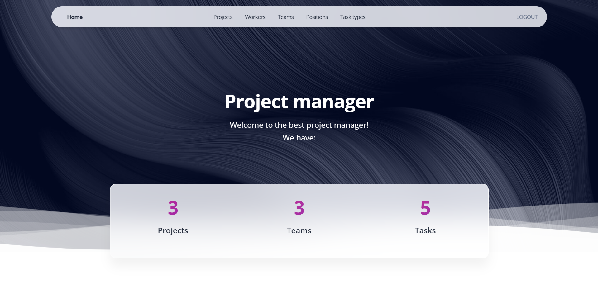

# IT Project manager

Simple project for managing tasks in IT teams. Team members can create, assign, and track tasks to stay on schedule.

## Check it out!

[Project manager deployed to Render](https://it-project-manager.onrender.com)

* login - admin12
* password - 1212

## Installing

Python3 must be installed

```shell
git clone https://github.com/NazarSlavych/IT-project-manager
cd IT-project-manager
python3 -m venv venv
source venv/bin/activate
pip install -r requirements.txt
python manage.py runserver # starts Django server
```

## Features

Here's what our IT project manager can do:
* Employee authentication support – secure login and role-based access control
* Task, project, and team management – create, assign, and track progress effortlessly
* Powerful admin panel – full control over users, permissions, and workflows

## Demo

